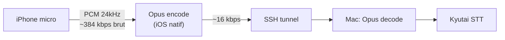
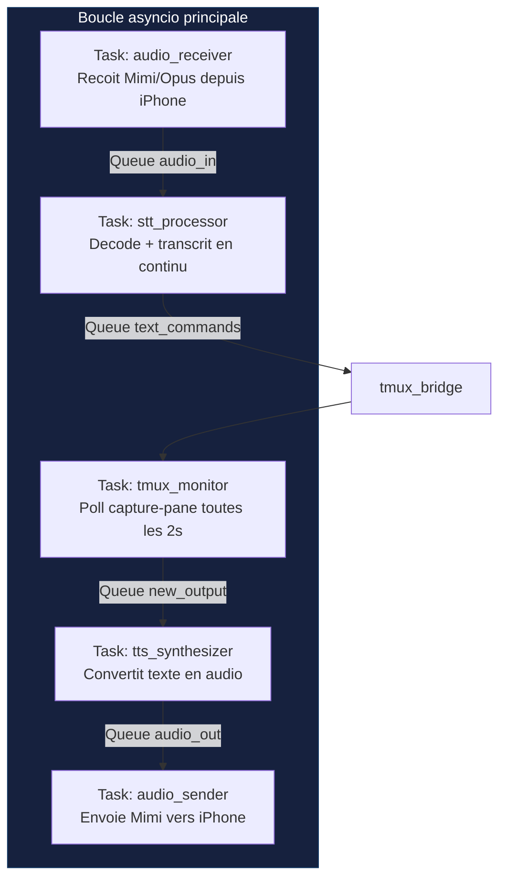

# Phase 0 — Architecture et decisions techniques

## Objectif

Definir les choix techniques fondamentaux avant toute ligne de code.

---

## Decisions cles

### 1. STT : Kyutai STT 1B (en_fr) plutot que 2.6B

**Choix** : `kyutai/stt-1b-en_fr`

**Raisons** :
- Supporte francais + anglais (le 2.6B est anglais uniquement)
- Inclut le **Semantic VAD** (Voice Activity Detection) natif — essentiel pour detecter quand l'utilisateur a fini de parler
- 1B parametres = plus leger, laisse de la VRAM pour le TTS simultane
- Latence plus faible (delay 0.5s vs 2.5s pour le 2.6B)

### 2. TTS : Kyutai TTS 1.6B (en_fr)

**Choix** : `kyutai/tts-1.6b-en_fr`

**Raisons** :
- Voix naturelle de haute qualite
- Streaming natif (commence a parler avant d'avoir tout le texte)
- Voice cloning via embeddings pre-calcules (`kyutai/tts-voices`)
- Support francais + anglais

### 3. Codec : Mimi via rustymimi

**Choix** : `rustymimi` (bindings Python du codec Rust)

**Raisons** :
- 1.1 kbps — fonctionne meme en 3G
- 80ms de latence (1 frame)
- Implementation Rust performante avec bindings Python et potentiel Swift
- Deja utilise par moshi_mlx, donc teste et stable

### 4. Transport : SSH + WebSocket

**Choix** : Tunnel SSH avec WebSocket interne

**Raisons** :
- SSH = chiffrement, authentification, compression — tout en un
- WebSocket par-dessus pour le multiplexage audio + controle
- Pas besoin de certificats TLS additionnels
- L'iPhone peut initier la connexion SSH meme en 4G (pas de NAT traversal cote Mac)

### 5. Serveur : Python asyncio

**Choix** : Python 3.12+ avec asyncio

**Raisons** :
- Kyutai STT/TTS sont en Python (PyTorch)
- asyncio gere naturellement les streams concurrents (audio in + out + tmux polling)
- Pas besoin de performance brute cote orchestration (le GPU fait le travail lourd)

### 6. Client iOS : Swift natif

**Choix** : App Swift avec AVFoundation

**Raisons** :
- Acces direct au micro et haut-parleur (AVAudioEngine)
- Peut tourner en arriere-plan (background audio mode)
- `rustymimi` compilable pour iOS via `uniffi` ou bridge C
- Pas de dependance a un framework tiers lourd

---

## Contraintes identifiees

| Contrainte | Impact | Mitigation |
|-----------|--------|-----------|
| VRAM limitee (Apple Silicon unified memory) | STT + TTS concurrent peut etre serre sur 16 Go | Utiliser MLX pour le STT, PyTorch pour le TTS, ou sequentialiser |
| Mimi sur iOS | Pas de bindings Swift officiels | Compiler rustymimi comme xcframework, ou encoder en PCM brut cote iPhone et laisser le Mac encoder/decoder |
| Latence 4G | 50-200ms RTT additionnel | Le codec Mimi (80ms frame) est deja optimise pour ca |
| Claude Code est interactif | Pas d'API directe pour injecter/lire | tmux send-keys + capture-pane comme bridge |
| Duree de session tmux | Le buffer peut etre enorme | Ne capturer que le delta (diff entre captures) |

---

## Alternative simplifiee pour le client iPhone

Si compiler Mimi pour iOS est trop complexe en phase initiale :

On peut commencer avec Opus (supporte nativement par iOS) et migrer vers Mimi plus tard. La bande passante passe de 1.1 kbps a ~16 kbps — toujours tres confortable en 4G.

---

## Modele de concurrence du serveur

Chaque composant communique via des `asyncio.Queue` — decouplage total, pas de blocage.
