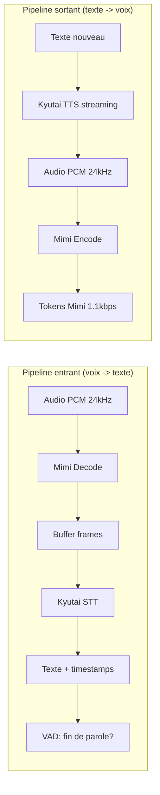

# Phase 2 — Pipeline audio STT + TTS + Mimi

## Objectif

Construire le pipeline audio complet : micro -> Mimi decode -> STT -> texte, puis texte -> TTS -> Mimi encode -> haut-parleur. Tester en local sur le Mac avant d'ajouter le reseau.

---

## Architecture du pipeline



---

## Etapes

### 2.1 — Module `stt.py` : Wrapper STT streaming

```python
# server/audioclaude/stt.py — Interface a implementer

class StreamingSTT:
    """Wrapper autour de Kyutai STT avec VAD integre."""

    def __init__(self, hf_repo="kyutai/stt-1b-en_fr", device="cuda"):
        # Charger modele, tokenizer, mimi interne
        pass

    async def feed_audio(self, pcm_chunk: torch.Tensor) -> None:
        """Alimente le STT avec un chunk audio PCM 24kHz.
        pcm_chunk shape: [1, 1, frame_size]
        """
        pass

    async def get_transcription(self) -> TranscriptionResult | None:
        """Retourne la transcription si de la parole a ete detectee.
        Utilise le VAD semantique pour detecter la fin de phrase.
        """
        pass
```

**Points critiques** :
- Le STT fonctionne en streaming : on alimente frame par frame (12.5 Hz = 80ms par frame)
- Le VAD semantique du modele 1B detecte quand l'utilisateur a fini de parler
- Les frames doivent etre exactement de taille `mimi.frame_size` (1920 samples a 24kHz)

### 2.2 — Module `tts.py` : Wrapper TTS streaming

```python
# server/audioclaude/tts.py — Interface a implementer

class StreamingTTS:
    """Wrapper autour de Kyutai TTS avec streaming."""

    def __init__(self, hf_repo="kyutai/tts-1.6b-en_fr", device="cuda",
                 voice="expresso/ex03-ex01_happy_001_channel1_334s.wav"):
        # Charger modele, voice embedding
        pass

    async def synthesize(self, text: str) -> AsyncIterator[torch.Tensor]:
        """Synthetise du texte en audio PCM, yielde chunk par chunk.
        Chaque chunk est un segment audio PCM 24kHz pret pour Mimi.
        """
        pass
```

**Points critiques** :
- Le TTS streaming commence a generer de l'audio avant d'avoir tout le texte
- Configurable : `n_q` (8-32, qualite), `temp` (creativite), `cfg_coef` (adherence)
- Voice cloning via embeddings pre-calcules dans `kyutai/tts-voices`

### 2.3 — Module `mimi_codec.py` : Encode/Decode Mimi

```python
# server/audioclaude/mimi_codec.py — Interface a implementer

class MimiCodec:
    """Gere l'encodage/decodage Mimi pour le transport."""

    def __init__(self, device="cpu"):
        # Charger mimi via rustymimi ou PyTorch
        pass

    def encode_frame(self, pcm_frame: torch.Tensor) -> bytes:
        """Encode un frame PCM en tokens Mimi serialises.
        Input: [1, 1, 1920] PCM 24kHz
        Output: bytes representant les tokens pour ce frame
        """
        pass

    def decode_frame(self, mimi_bytes: bytes) -> torch.Tensor:
        """Decode des tokens Mimi en PCM.
        Input: bytes de tokens Mimi
        Output: [1, 1, 1920] PCM 24kHz
        """
        pass
```

**Points critiques** :
- Mimi tourne a 12.5 Hz (80ms par frame, 1920 samples)
- En mode streaming, toujours alimenter exactement `frame_size` samples
- Sur GPU, les appels sont CUDAGraphes : toujours la meme taille d'input

### 2.4 — Test du pipeline complet en local

```python
# Test : micro -> STT -> print -> TTS -> haut-parleur
# Tout en local sur le Mac, sans reseau

async def test_pipeline():
    stt = StreamingSTT()
    tts = StreamingTTS()

    # Capturer depuis le micro
    audio_stream = capture_microphone(sample_rate=24000)

    async for chunk in audio_stream:
        await stt.feed_audio(chunk)
        result = await stt.get_transcription()

        if result and result.is_final:
            print(f"Transcrit: {result.text}")
            # Synthetiser la reponse (test echo)
            async for audio_chunk in tts.synthesize(result.text):
                play_audio(audio_chunk)
```

---

## Choix de la voix TTS

Kyutai fournit des voix pre-calculees dans `kyutai/tts-voices`. Pour le projet :

- **Defaut** : `expresso/ex03-ex01_happy_001_channel1_334s.wav` (voix claire, ton positif)
- **Option** : Creer un embedding custom a partir de n'importe quel sample audio de 30s+

```python
# Pour changer de voix :
voice_path = tts_model.get_voice_path("expresso/ex03-ex01_happy_001_channel1_334s.wav")
condition = tts_model.make_condition_attributes([voice_path], cfg_coef=2.0)
```

---

## Metriques de performance a valider

| Metrique | Cible | Comment mesurer |
|----------|-------|-----------------|
| Latence STT | < 500ms apres fin de parole | Timestamp VAD -> texte disponible |
| Latence TTS | < 300ms premier audio | Texte soumis -> premier chunk audio |
| Qualite STT | WER < 15% (conversation) | Comparer avec transcription manuelle |
| Qualite TTS | MOS > 3.5 (subjectif) | Ecoute humaine |
| Throughput Mimi | Temps reel (1x) | Encoder 1s d'audio en < 1s |

---

## Fichiers a creer

```
server/audioclaude/
├── stt.py              # Wrapper STT streaming
├── tts.py              # Wrapper TTS streaming
├── mimi_codec.py       # Encode/decode Mimi
└── audio_utils.py      # Capture micro, lecture audio, resampling
```
