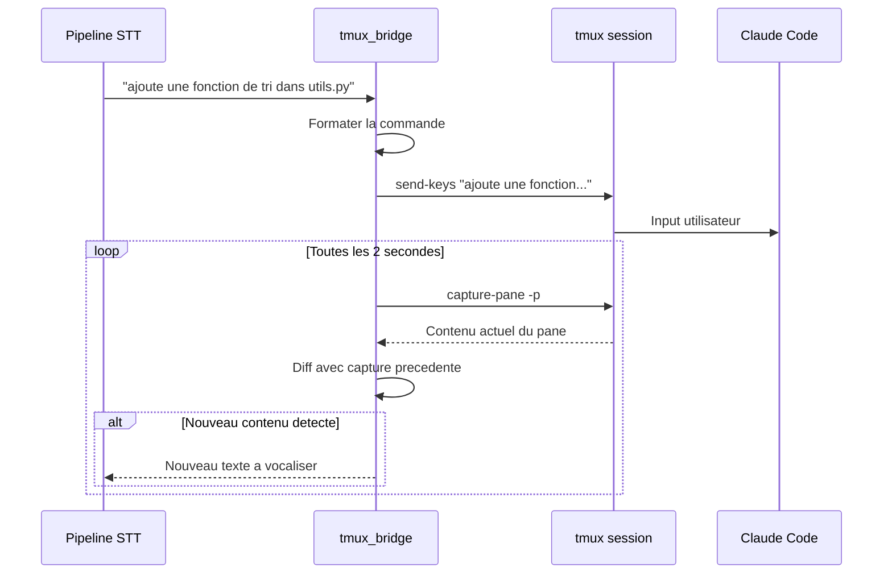

# Phase 3 — Integration tmux <-> Claude Code

## Objectif

Creer le bridge entre le pipeline audio et Claude Code via tmux. Le serveur doit pouvoir injecter des commandes texte dans Claude Code et lire ses reponses.

---

## Principe



---

## Etapes

### 3.1 — Module `tmux_bridge.py`

```python
# server/audioclaude/tmux_bridge.py — Interface a implementer

class TmuxBridge:
    """Interface entre AudioClaude et une session tmux."""

    SESSION_NAME = "audioclaude"
    POLL_INTERVAL = 2.0  # secondes

    def __init__(self, session_name: str = SESSION_NAME):
        self.session_name = session_name
        self._last_capture = ""
        self._last_capture_hash = ""

    async def ensure_session(self) -> None:
        """Cree la session tmux si elle n'existe pas.
        Lance Claude Code dedans si demande.
        """
        pass

    async def send_command(self, text: str) -> None:
        """Injecte du texte dans le pane tmux actif.
        Utilise tmux send-keys.
        """
        pass

    async def send_enter(self) -> None:
        """Envoie Enter pour valider la commande."""
        pass

    async def get_new_output(self) -> str | None:
        """Capture le contenu du pane et retourne uniquement
        le delta par rapport a la derniere capture.
        """
        pass

    async def monitor_output(self) -> AsyncIterator[str]:
        """Boucle infinie qui yield les nouveaux contenus
        detectes dans le pane tmux.
        """
        pass
```

### 3.2 — Commandes tmux sous-jacentes

```bash
# Creer la session
tmux new-session -d -s audioclaude -x 200 -y 50

# Lancer Claude Code dans la session
tmux send-keys -t audioclaude "claude" Enter

# Injecter une commande utilisateur
tmux send-keys -t audioclaude "corrige le bug dans server.py" Enter

# Capturer le contenu visible du pane
tmux capture-pane -t audioclaude -p -S -50

# Capturer TOUT le scrollback
tmux capture-pane -t audioclaude -p -S -
```

### 3.3 — Detection intelligente du delta

Le challenge principal : detecter ce qui est **nouveau** dans la sortie de Claude.

```python
async def get_new_output(self) -> str | None:
    # Capturer le pane actuel
    result = await run_tmux("capture-pane", "-t", self.session_name, "-p", "-S", "-100")
    current = result.stdout.strip()

    if current == self._last_capture:
        return None

    # Trouver le delta
    old_lines = self._last_capture.split('\n')
    new_lines = current.split('\n')

    # Chercher ou commence le nouveau contenu
    # en trouvant le dernier bloc commun
    delta_lines = []
    match_idx = -1
    if old_lines:
        last_old = old_lines[-1].strip()
        for i, line in enumerate(new_lines):
            if line.strip() == last_old:
                match_idx = i

    if match_idx >= 0:
        delta_lines = new_lines[match_idx + 1:]
    else:
        delta_lines = new_lines

    self._last_capture = current
    delta = '\n'.join(delta_lines).strip()
    return delta if delta else None
```

### 3.4 — Filtrage du contenu pour le TTS

Tout le contenu du terminal ne doit pas etre lu a voix haute. Il faut filtrer :

```python
class OutputFilter:
    """Filtre le contenu tmux avant de l'envoyer au TTS."""

    # Patterns a ignorer (ne pas vocaliser)
    SKIP_PATTERNS = [
        r'^\s*$',                    # Lignes vides
        r'^\s*[\-=]{3,}',           # Separateurs visuels
        r'^\s*\d+\s*\|',            # Numeros de ligne (code)
        r'^[\s│├└─┐┌┘┬┴┼]+$',      # Bordures de tableaux
        r'^\s*\.\.\.',              # Ellipses
        r'^\$\s',                    # Prompts shell
    ]

    # Patterns a transformer
    TRANSFORMS = [
        # Enlever le markdown
        (r'\*\*(.*?)\*\*', r'\1'),   # Bold
        (r'`(.*?)`', r'\1'),         # Code inline
        (r'^#{1,6}\s+', ''),         # Headings
        (r'^\s*[-*]\s+', ''),        # Bullet points -> texte simple
    ]

    def filter(self, text: str) -> str:
        """Retourne le texte filtre pret pour le TTS."""
        pass

    def summarize_if_long(self, text: str, max_chars: int = 500) -> str:
        """Si le texte est trop long, le resumer.
        Utile quand Claude produit beaucoup de code.
        """
        pass
```

### 3.5 — Gestion des modes de Claude Code

Claude Code a differents etats qu'il faut reconnaitre :

```python
class ClaudeCodeState(Enum):
    IDLE = "idle"               # Attend une commande
    THINKING = "thinking"       # Reflechit (spinner visible)
    WRITING = "writing"         # Ecrit du code
    ASKING = "asking"           # Pose une question / demande confirmation
    TOOL_USE = "tool_use"       # Utilise un outil (Read, Edit, Bash...)
    ERROR = "error"             # Erreur affichee

def detect_state(pane_content: str) -> ClaudeCodeState:
    """Detecte l'etat actuel de Claude Code."""
    pass
```

Selon l'etat :
- **IDLE** : Lire la derniere reponse complete
- **THINKING** : Attendre, ne rien lire
- **ASKING** : Lire la question et attendre la reponse vocale
- **WRITING** : Resumer ("Claude ecrit du code dans tel fichier")
- **ERROR** : Lire l'erreur

---

## Cas particuliers

### Commandes speciales vocales

Certaines commandes vocales doivent etre interpretees comme des actions tmux/Claude :

| Commande vocale | Action |
|-----------------|--------|
| "valide" / "confirme" / "oui" | `send-keys "y" Enter` |
| "annule" / "non" | `send-keys "n" Enter` ou `Ctrl+C` |
| "scroll up" / "remonte" | `tmux copy-mode` + scroll |
| "lis moi ce qu'il y a" | Capture complete + TTS |
| "status" | Lire l'etat actuel de Claude |
| "pause" | Arreter le monitoring TTS |
| "reprends" | Reprendre le monitoring TTS |

### Gestion du buffer scrollback

```bash
# Configurer un scrollback suffisant
tmux set-option -t audioclaude history-limit 10000
```

---

## Fichiers a creer

```
server/audioclaude/
├── tmux_bridge.py      # Interface tmux
├── output_filter.py    # Filtrage contenu pour TTS
└── claude_state.py     # Detection etat de Claude Code
```
