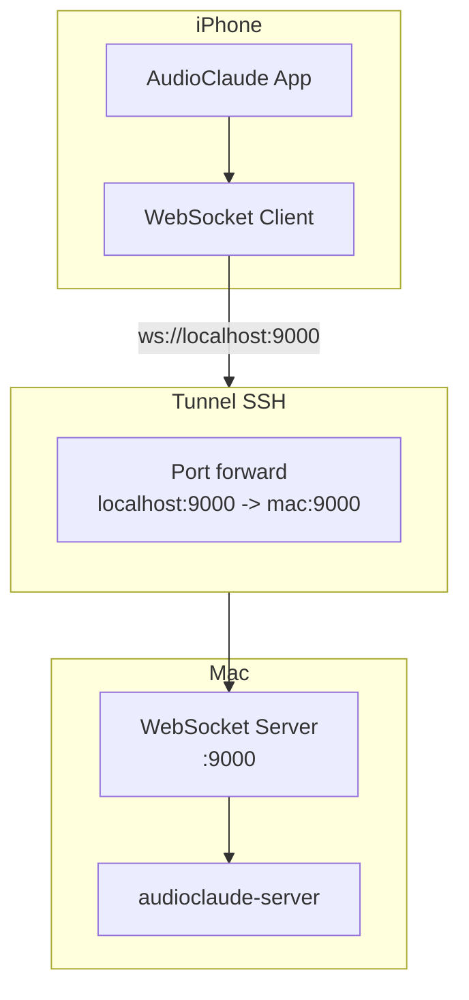
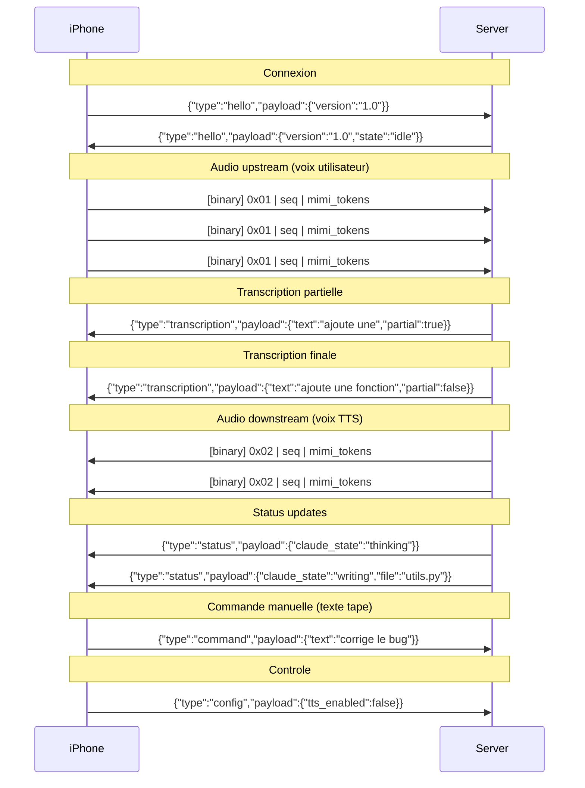
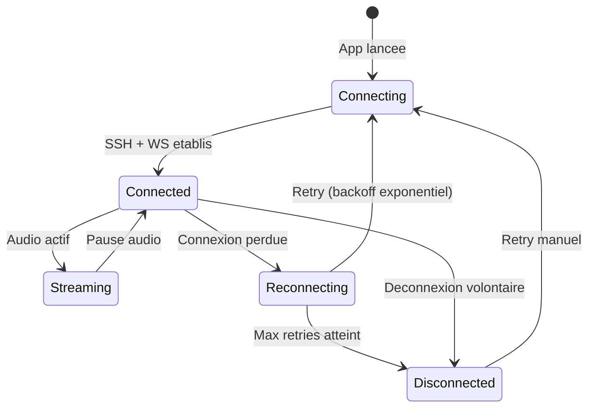

# Phase 4 — Protocole de transport SSH + WebSocket

## Objectif

Definir et implementer le protocole de communication entre l'iPhone et le Mac via SSH, avec multiplexage audio bidirectionnel et canal de controle.

---

## Architecture reseau



**Un seul port WebSocket (9000)** avec multiplexage par type de message — plus simple qu'un port par canal.

---

## Protocole WebSocket

### Format des messages

Chaque message WebSocket est soit binaire (audio) soit texte (controle JSON).

```
Messages binaires (audio):
┌──────────┬──────────┬─────────────────────┐
│ Type (1B)│ Seq (4B) │ Payload (variable)  │
│ 0x01=up  │ uint32   │ Mimi tokens         │
│ 0x02=down│          │ Mimi tokens         │
└──────────┴──────────┴─────────────────────┘

Messages texte (controle JSON):
{
  "type": "status" | "command" | "transcription" | "error" | "config",
  "payload": { ... },
  "timestamp": 1234567890.123
}
```

### Types de messages



---

## Etapes

### 4.1 — Serveur WebSocket (Mac)

```python
# server/audioclaude/server.py — Interface a implementer

class AudioClaudeServer:
    """Serveur WebSocket principal."""

    def __init__(self, host="localhost", port=9000):
        self.host = host
        self.port = port
        self.stt = StreamingSTT()
        self.tts = StreamingTTS()
        self.codec = MimiCodec()
        self.bridge = TmuxBridge()

    async def start(self):
        """Lance le serveur WebSocket."""
        async with websockets.serve(self.handle_client, self.host, self.port):
            await asyncio.Future()  # Run forever

    async def handle_client(self, websocket):
        """Gere une connexion client."""
        # Lancer les taches concurrentes
        await asyncio.gather(
            self.receive_audio(websocket),      # Audio iPhone -> STT
            self.send_audio(websocket),          # TTS -> Audio iPhone
            self.monitor_tmux(websocket),         # Polling tmux
            self.receive_commands(websocket),     # Commandes texte
        )

    async def receive_audio(self, ws):
        """Recoit l'audio Mimi, decode, envoie au STT."""
        pass

    async def send_audio(self, ws):
        """Prend la sortie TTS, encode en Mimi, envoie."""
        pass

    async def monitor_tmux(self, ws):
        """Poll tmux, detecte nouveau contenu, envoie au TTS + status."""
        pass

    async def receive_commands(self, ws):
        """Recoit les commandes texte tapees sur iPhone."""
        pass
```

### 4.2 — Setup SSH sur le Mac

```bash
# Verifier que sshd est actif
sudo systemsetup -setremotelogin on

# Ou via System Preferences > Sharing > Remote Login

# Generer une cle pour l'iPhone (sur le Mac)
ssh-keygen -t ed25519 -f ~/.ssh/audioclaude_iphone -N ""

# Copier la cle publique (a transferer sur l'iPhone)
cat ~/.ssh/audioclaude_iphone.pub
```

### 4.3 — Tunnel SSH depuis l'iPhone

L'iPhone etablit le tunnel SSH avec port forwarding :

```bash
# Commande equivalente (sera executee par l'app Swift)
ssh -N -L 9000:localhost:9000 \
    -i ~/.ssh/audioclaude_iphone \
    -o ServerAliveInterval=30 \
    -o ServerAliveCountMax=3 \
    user@mac-ip-or-hostname
```

**Options importantes** :
- `-N` : Pas de shell, juste le tunnel
- `-L 9000:localhost:9000` : Forward du port WebSocket
- `ServerAliveInterval=30` : Keepalive toutes les 30s (evite deconnexion 4G)
- `ServerAliveCountMax=3` : Deconnecte apres 90s sans reponse

### 4.4 — Gestion de la reconnexion



Strategie de reconnexion :
1. Detection de perte : WebSocket ping/pong timeout (10s)
2. Retry immediat (1x)
3. Backoff exponentiel : 2s, 4s, 8s, 16s, 30s max
4. Notification utilisateur apres 3 echecs
5. Le serveur Mac conserve l'etat — la session tmux persiste

---

## Securite

| Aspect | Implementation |
|--------|---------------|
| Chiffrement | SSH (AES-256-GCM) |
| Authentification | Cle Ed25519 (pas de mot de passe) |
| Autorisation | Cle specifique AudioClaude, restrict command optionnel |
| Integrite | SSH MAC + WebSocket frame masking |
| Confidentialite | Tout le trafic passe dans le tunnel SSH |

### Restriction optionnelle de la cle SSH

```bash
# Dans ~/.ssh/authorized_keys sur le Mac
restrict,port-forwarding,permitopen="localhost:9000" ssh-ed25519 AAAA... audioclaude-iphone
```

Cela limite la cle a ne faire **que** du port forwarding vers le port 9000.

---

## Fichiers a creer

```
server/audioclaude/
├── server.py           # Serveur WebSocket principal
├── protocol.py         # Definition du protocole de messages
└── connection.py       # Gestion connexion/reconnexion
```
