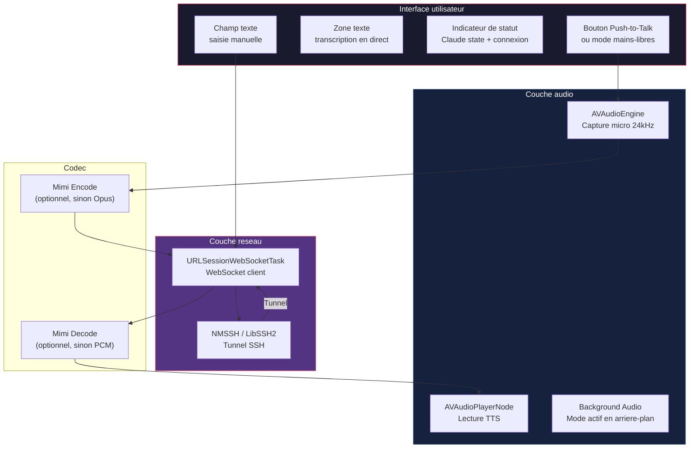
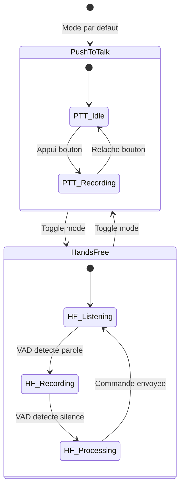

# Phase 5 — Client iPhone (App Swift)

## Objectif

Creer une app iOS minimale mais fonctionnelle qui sert de terminal vocal distant pour AudioClaude.

---

## Fonctionnalites de l'app



---

## Etapes

### 5.1 — Projet Xcode

Creer un projet Xcode avec :
- **Target** : iOS 17+
- **Capabilities** :
  - Background Modes > Audio (pour continuer en arriere-plan)
  - Network > Outgoing Connections
- **Frameworks** :
  - AVFoundation (audio)
  - Network (NWConnection pour TCP si besoin)

### 5.2 — Capture audio (`AudioCapture.swift`)

```swift
// Sources/AudioCapture.swift — Interface a implementer

class AudioCapture: ObservableObject {
    private let engine = AVAudioEngine()
    private let targetSampleRate: Double = 24000

    @Published var isRecording = false

    /// Callback appele avec chaque buffer PCM 24kHz
    var onAudioBuffer: ((Data) -> Void)?

    func startCapturing() {
        // Configurer AVAudioSession pour enregistrement
        // Installer un tap sur inputNode
        // Resampler a 24kHz si necessaire
        // Appeler onAudioBuffer avec les donnees PCM
    }

    func stopCapturing() {
        engine.stop()
        isRecording = false
    }
}
```

**Points critiques** :
- L'iPhone capture generalement en 44.1kHz ou 48kHz — resampler a 24kHz pour Mimi
- Configurer `AVAudioSession` en mode `.playAndRecord` avec `.allowBluetooth` pour les AirPods
- Activer le background audio pour continuer a enregistrer en arriere-plan

### 5.3 — Lecture audio (`AudioPlayback.swift`)

```swift
// Sources/AudioPlayback.swift — Interface a implementer

class AudioPlayback: ObservableObject {
    private let engine = AVAudioEngine()
    private let playerNode = AVAudioPlayerNode()
    private var audioFormat: AVAudioFormat!

    @Published var isPlaying = false

    func setupPlayback() {
        // Format: PCM 24kHz, mono, float32
        // Attacher playerNode a l'engine
        // Connecter au mainMixerNode
    }

    func playBuffer(_ pcmData: Data) {
        // Convertir Data en AVAudioPCMBuffer
        // Scheduler sur playerNode
    }

    func stop() {
        playerNode.stop()
        isPlaying = false
    }
}
```

### 5.4 — Transport SSH (`SSHTransport.swift`)

**Option A : NMSSH (le plus simple)**

```swift
// Utiliser le package NMSSH pour le tunnel SSH
// Pod: pod 'NMSSH'

class SSHTransport {
    private var session: NMSSHSession?
    private var channel: NMSSHChannel?

    func connect(host: String, port: Int, username: String, keyPath: String) async throws {
        // Etablir connexion SSH
        // Authentification par cle
        // Configurer port forwarding local 9000 -> remote 9000
    }
}
```

**Option B : Processus SSH systeme (via Network Extension)**

Pour une approche plus legere, l'app peut configurer un profil VPN/SSH via les APIs systeme, mais c'est plus complexe.

**Option C : Connexion WebSocket directe (dev uniquement)**

En WiFi local, se connecter directement au serveur WebSocket sans SSH :
```swift
let ws = URLSession.shared.webSocketTask(with: URL(string: "ws://mac.local:9000")!)
```

### 5.5 — Client WebSocket (`WebSocketClient.swift`)

```swift
// Sources/WebSocketClient.swift — Interface a implementer

class WebSocketClient: ObservableObject {
    private var task: URLSessionWebSocketTask?

    @Published var isConnected = false
    @Published var claudeState: String = "idle"
    @Published var lastTranscription: String = ""

    /// Callbacks
    var onAudioReceived: ((Data) -> Void)?
    var onTranscription: ((String, Bool) -> Void)?
    var onStatusUpdate: ((String) -> Void)?

    func connect(url: URL) {
        task = URLSession.shared.webSocketTask(with: url)
        task?.resume()
        isConnected = true
        receiveLoop()
    }

    func sendAudio(_ data: Data) {
        // Construire le message binaire : 0x01 + seq + payload
        // Envoyer via WebSocket
    }

    func sendCommand(_ text: String) {
        // Envoyer un message JSON de type "command"
    }

    private func receiveLoop() {
        task?.receive { [weak self] result in
            switch result {
            case .success(.data(let data)):
                // Message binaire = audio TTS
                self?.onAudioReceived?(data)
            case .success(.string(let text)):
                // Message JSON = status/transcription
                self?.handleControlMessage(text)
            default:
                break
            }
            self?.receiveLoop()
        }
    }
}
```

### 5.6 — Interface utilisateur (`ContentView.swift`)

```swift
// Design minimaliste : 
// - Grand bouton central pour push-to-talk
// - Texte de transcription en temps reel
// - Statut de Claude en haut
// - Champ texte en bas pour saisie manuelle

struct ContentView: View {
    @StateObject var audioCapture = AudioCapture()
    @StateObject var audioPlayback = AudioPlayback()
    @StateObject var wsClient = WebSocketClient()

    var body: some View {
        VStack {
            // Status bar
            StatusBar(state: wsClient.claudeState,
                     connected: wsClient.isConnected)

            // Zone de transcription
            TranscriptionView(text: wsClient.lastTranscription)

            Spacer()

            // Bouton Push-to-Talk
            PushToTalkButton(isRecording: audioCapture.isRecording) {
                audioCapture.startCapturing()
            } onRelease: {
                audioCapture.stopCapturing()
            }

            // Champ texte manuel
            ManualInputField { text in
                wsClient.sendCommand(text)
            }
        }
    }
}
```

---

## Gestion de l'arriere-plan iOS

Pour que l'app continue de fonctionner quand l'utilisateur fait ses courses :

```swift
// Dans AppDelegate ou App init
func configureBackgroundAudio() {
    let session = AVAudioSession.sharedInstance()
    try session.setCategory(.playAndRecord,
                           mode: .voiceChat,
                           options: [.allowBluetooth,
                                    .defaultToSpeaker,
                                    .mixWithOthers])
    try session.setActive(true)
}
```

**Info.plist** :
```xml
<key>UIBackgroundModes</key>
<array>
    <string>audio</string>
</array>
```

Avec le mode `audio`, l'app reste active tant qu'elle joue ou enregistre du son.

---

## Modes d'interaction



- **Push-to-Talk** : Plus fiable, pas de faux positifs. Ideal en environnement bruyant.
- **Mains-libres** : VAD cote serveur (Kyutai STT). Ideal en voiture ou a pied.

---

## Codec audio cote iPhone

### Strategie progressive

**Phase 1 (MVP)** : Envoyer du PCM brut ou Opus encode (iOS natif)
```swift
// Opus est supporte nativement par AVAudioConverter
// ~16kbps au lieu de 1.1kbps Mimi, mais suffisant en WiFi/4G
```

**Phase 2** : Integrer Mimi via rustymimi compile en xcframework
```bash
# Sur le Mac, cross-compiler rustymimi pour iOS
cargo build --target aarch64-apple-ios --release -p mimi-pyo3
# Puis creer un xcframework avec les headers C
```

---

## Fichiers a creer

```
ios/AudioClaude/
├── AudioClaude.xcodeproj
├── Sources/
│   ├── App.swift               # Point d'entree SwiftUI
│   ├── ContentView.swift       # UI principale
│   ├── AudioCapture.swift      # Capture micro
│   ├── AudioPlayback.swift     # Lecture audio
│   ├── WebSocketClient.swift   # Client WebSocket
│   ├── SSHTransport.swift      # Tunnel SSH
│   ├── StatusBar.swift         # Barre de statut
│   ├── TranscriptionView.swift # Affichage transcription
│   ├── PushToTalkButton.swift  # Bouton PTT
│   └── ManualInputField.swift  # Champ texte
├── Resources/
│   └── Info.plist
└── AudioClaude.entitlements
```
