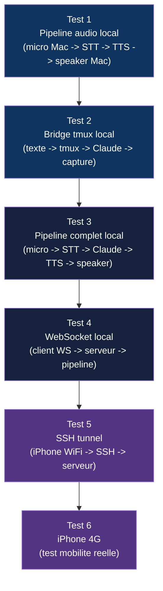

# Phase 6 — Tests d'integration bout-en-bout

## Objectif

Valider que tous les composants fonctionnent ensemble : iPhone -> SSH -> STT -> tmux/Claude -> TTS -> iPhone.

---

## Plan de test progressif



---

## Tests detailles

### Test 1 — Pipeline audio local

**Setup** : Tout sur le Mac, pas de reseau.

```bash
# Lancer le test pipeline audio
python -m audioclaude.test_audio_pipeline
```

**Scenario** :
1. Capturer 5 secondes de micro
2. Encoder en Mimi
3. Decoder Mimi
4. Transcrire via STT
5. Synthetiser la transcription via TTS
6. Jouer l'audio synthetise

**Criteres de succes** :
- [ ] La transcription STT est correcte (WER < 15%)
- [ ] L'audio TTS est intelligible et naturel
- [ ] Latence totale micro->speaker < 3 secondes
- [ ] Pas de crash, pas de fuite memoire

### Test 2 — Bridge tmux

**Setup** : Tout sur le Mac, pas d'audio.

```bash
# Lancer Claude Code dans tmux
tmux new-session -d -s audioclaude "claude"

# Lancer le test bridge
python -m audioclaude.test_tmux_bridge
```

**Scenario** :
1. Injecter "dis bonjour" via send-keys
2. Attendre la reponse de Claude (poll capture-pane)
3. Detecter le nouveau contenu
4. Filtrer pour le TTS

**Criteres de succes** :
- [ ] La commande est correctement injectee
- [ ] Le nouveau contenu est detecte en < 5 secondes
- [ ] Le filtre supprime correctement le bruit (prompts, lignes vides)
- [ ] L'etat de Claude est correctement detecte

### Test 3 — Pipeline complet local

**Setup** : Mac uniquement, avec audio et tmux.

```bash
python -m audioclaude.test_full_local
```

**Scenario** :
1. Parler dans le micro : "cree un fichier hello.py avec un print hello world"
2. STT transcrit
3. Bridge injecte dans Claude Code
4. Claude Code cree le fichier
5. Bridge detecte la reponse
6. TTS lit la reponse
7. Speaker joue l'audio

**Criteres de succes** :
- [ ] Le fichier hello.py est cree
- [ ] La reponse de Claude est lue vocalement
- [ ] Le cycle complet prend < 15 secondes (hors temps Claude)
- [ ] Pas d'echo (le TTS ne re-declenche pas le STT)

### Test 4 — WebSocket local

**Setup** : Serveur WebSocket sur Mac, client Python sur Mac.

```bash
# Terminal 1 : serveur
python -m audioclaude.server

# Terminal 2 : client de test
python -m audioclaude.test_ws_client
```

**Scenario** :
1. Client se connecte au WebSocket
2. Client envoie un message audio encode
3. Serveur transcrit et repond avec l'audio TTS
4. Client recoit et decode

**Criteres de succes** :
- [ ] Connexion WebSocket stable
- [ ] Messages binaires (audio) correctement transmis
- [ ] Messages JSON (controle) correctement parses
- [ ] Reconnexion automatique apres deconnexion simulee

### Test 5 — SSH tunnel (WiFi)

**Setup** : iPhone sur le meme WiFi que le Mac.

```bash
# Sur le Mac
python -m audioclaude.server

# Sur l'iPhone (via l'app ou un client SSH)
# Tunnel : localhost:9000 -> mac:9000
```

**Scenario** :
1. Etablir le tunnel SSH depuis l'iPhone
2. Se connecter au WebSocket via le tunnel
3. Dicter une commande
4. Recevoir la reponse vocale

**Criteres de succes** :
- [ ] Tunnel SSH stable pendant 10+ minutes
- [ ] Latence additionnelle du tunnel < 50ms (WiFi)
- [ ] Audio bidirectionnel sans artefacts
- [ ] Reconnexion automatique apres perte WiFi simulee

### Test 6 — Mobilite 4G

**Setup** : iPhone en 4G, Mac sur le WiFi/ethernet.

**Prerequis** : Le Mac doit etre accessible depuis Internet (port forwarding sur le routeur, ou VPN, ou Tailscale).

**Scenario** :
1. Sortir du WiFi, passer en 4G
2. Se connecter via SSH au Mac
3. Dicter une commande depuis la rue
4. Recevoir la reponse dans les AirPods
5. Marcher pendant 10 minutes en interagissant

**Criteres de succes** :
- [ ] Connexion SSH stable en 4G pendant 10+ minutes
- [ ] Latence totale (voix -> reponse) < 5 secondes
- [ ] Audio comprehensible malgre le bruit ambiant
- [ ] Reconnexion automatique apres passage 4G -> WiFi
- [ ] Bande passante Mimi ~3kbps confirmee

---

## Matrice de compatibilite

| Test | Mac Intel + NVIDIA | Mac Apple Silicon | iPhone WiFi | iPhone 4G |
|------|-------------------|-------------------|-------------|-----------|
| Pipeline audio | PyTorch CUDA | MLX ou PyTorch MPS | N/A | N/A |
| Bridge tmux | OK | OK | N/A | N/A |
| Pipeline complet | OK | OK | N/A | N/A |
| WebSocket | OK | OK | N/A | N/A |
| SSH WiFi | OK | OK | OK | N/A |
| SSH 4G | OK | OK | N/A | OK |

---

## Metriques a collecter

```python
# Ajouter du logging de performance
@dataclass
class Metrics:
    stt_latency_ms: float        # Temps STT (audio -> texte)
    tts_latency_ms: float        # Temps TTS (texte -> premier audio)
    tmux_poll_latency_ms: float  # Temps capture-pane
    network_rtt_ms: float        # RTT WebSocket ping/pong
    total_e2e_latency_ms: float  # Bout en bout (voix -> reponse audio)
    mimi_encode_ms: float        # Temps encodage Mimi par frame
    mimi_decode_ms: float        # Temps decodage Mimi par frame
    bandwidth_bps: float         # Bande passante reelle utilisee
```

---

## Fichiers a creer

```
server/tests/
├── test_audio_pipeline.py    # Test 1
├── test_tmux_bridge.py       # Test 2
├── test_full_local.py        # Test 3
├── test_ws_client.py         # Test 4
└── test_metrics.py           # Collecte metriques
```
