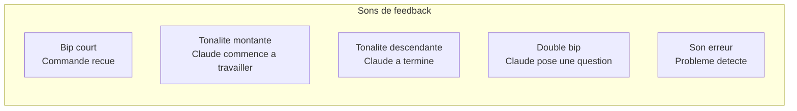
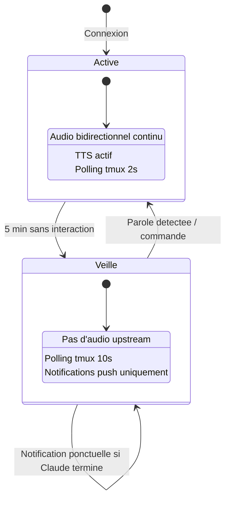

# Phase 7 — UX, robustesse et fonctionnalites avancees

## Objectif

Rendre AudioClaude agreable et fiable au quotidien. Gerer les cas limites, ameliorer l'experience utilisateur.

---

## Ameliorations UX

### 7.1 — Feedback audio intelligent



Au lieu de tout lire a voix haute, des sons courts indiquent l'etat :
- L'utilisateur sait que sa commande a ete recue sans attendre la transcription
- Il sait quand Claude travaille vs. quand il a fini

### 7.2 — Resume intelligent des longues sorties

Quand Claude produit beaucoup de code ou de texte :

```python
class SmartSummarizer:
    """Resume les longues sorties de Claude pour le TTS."""

    MAX_TTS_CHARS = 500  # Au-dela, resumer

    def process(self, claude_output: str) -> str:
        if len(claude_output) < self.MAX_TTS_CHARS:
            return claude_output

        # Detecter le type de contenu
        if self._is_code(claude_output):
            return self._summarize_code(claude_output)
        elif self._is_file_listing(claude_output):
            return self._summarize_files(claude_output)
        else:
            return self._summarize_text(claude_output)

    def _summarize_code(self, code: str) -> str:
        # "J'ai ecrit 45 lignes de Python dans utils.py,
        #  avec une fonction sort_by_date et une classe DataProcessor"
        pass

    def _summarize_files(self, listing: str) -> str:
        # "J'ai modifie 3 fichiers : utils.py, server.py et test_utils.py"
        pass
```

### 7.3 — Mode veille intelligente



En mode veille :
- Le micro est coupe (economie batterie)
- Le polling tmux passe a 10s
- Si Claude termine ou pose une question, une notification push reveille l'utilisateur
- L'utilisateur peut reprendre en parlant ou en tapant

### 7.4 — Historique des commandes vocales

```python
class CommandHistory:
    """Garde un historique des commandes vocales pour reference."""

    def __init__(self, db_path="~/.audioclaude/history.db"):
        # SQLite local
        pass

    def add(self, transcription: str, timestamp: float, response_summary: str):
        pass

    def get_recent(self, n: int = 20) -> list:
        pass

    def search(self, query: str) -> list:
        pass
```

Accessible depuis l'app iPhone pour revoir ce qui a ete dit/fait.

### 7.5 — Commandes vocales speciales

| Commande | Action | Feedback |
|----------|--------|----------|
| "Oui" / "Confirme" | Envoie `y` + Enter | Bip confirmation |
| "Non" / "Annule" | Envoie `n` + Enter ou Ctrl+C | Bip annulation |
| "Lis tout" | Capture complete + TTS integral | Audio complet |
| "Resume" | Capture + resume intelligent | Resume audio |
| "Status" | Etat Claude + derniere action | Audio court |
| "Pause lecture" | Arrete le TTS | Bip |
| "Repete" | Re-joue le dernier TTS | Audio repete |
| "Sauvegarde la session" | `/save` dans Claude | Bip confirmation |
| "Nouvelle conversation" | `/clear` dans Claude | Bip + "Nouvelle session" |

---

## Robustesse

### 7.6 — Anti-echo

Probleme : le TTS joue dans les AirPods, le micro les capte, le STT les transcrit -> boucle infinie.

Solutions :
1. **Push-to-Talk** : Le micro est coupe pendant la lecture TTS (le plus simple)
2. **Ducking** : Baisser la sensibilite du STT pendant la lecture TTS
3. **Echo cancellation** : Soustraire le signal TTS du signal micro (complexe)

**Recommandation** : Phase 1 = Push-to-Talk. Phase 2 = Ducking. Echo cancellation uniquement si necessaire.

### 7.7 — Gestion de la bande passante

```python
class AdaptiveBitrate:
    """Adapte la qualite selon la bande passante disponible."""

    async def measure_bandwidth(self) -> float:
        """Mesure la bande passante via WebSocket ping/pong timing."""
        pass

    def select_codec(self, bandwidth_kbps: float) -> str:
        if bandwidth_kbps > 100:
            return "pcm"        # Pas de compression
        elif bandwidth_kbps > 20:
            return "opus_16k"   # Opus a 16kbps
        elif bandwidth_kbps > 5:
            return "mimi"       # Mimi a 1.1kbps
        else:
            return "text_only"  # Pas d'audio, texte uniquement
```

### 7.8 — Gestion de la batterie iPhone

- Utiliser `ProcessInfo.thermalState` pour ajuster le comportement
- Reduire le polling en mode veille
- Couper l'audio upstream si l'ecran est eteint (sauf mains-libres)
- Afficher le niveau de batterie du Mac dans l'app

### 7.9 — Accessibilite depuis le Mac au retour

Quand l'utilisateur revient a son Mac :
1. L'app iPhone detecte le retour WiFi
2. Notification : "Vous etes de retour. Continuer depuis le Mac ?"
3. La session tmux est toujours la, intacte
4. L'utilisateur reprend Claude Code directement depuis le terminal
5. L'app iPhone passe en veille automatiquement

---

## Fonctionnalites futures (hors scope initial)

- **Multi-session** : Gerer plusieurs sessions tmux / Claude en parallele
- **Apple Watch** : Commandes vocales depuis la montre
- **Raccourcis Siri** : "Hey Siri, dis a Claude de..."
- **Widget iOS** : Status de Claude sur l'ecran d'accueil
- **CarPlay** : Interface vocale en voiture
- **Transcription permanente** : Log de tout ce que Claude fait, consultable plus tard
- **Notifications intelligentes** : "Claude a fini la tache X" via push notification

---

## Fichiers a creer/modifier

```
server/audioclaude/
├── summarizer.py         # Resume intelligent
├── command_parser.py     # Commandes vocales speciales
├── history.py            # Historique SQLite
└── adaptive.py           # Bitrate adaptatif

ios/AudioClaude/Sources/
├── SleepMode.swift       # Mode veille
├── CommandHistory.swift  # Historique local
└── SoundFeedback.swift   # Sons de feedback
```
