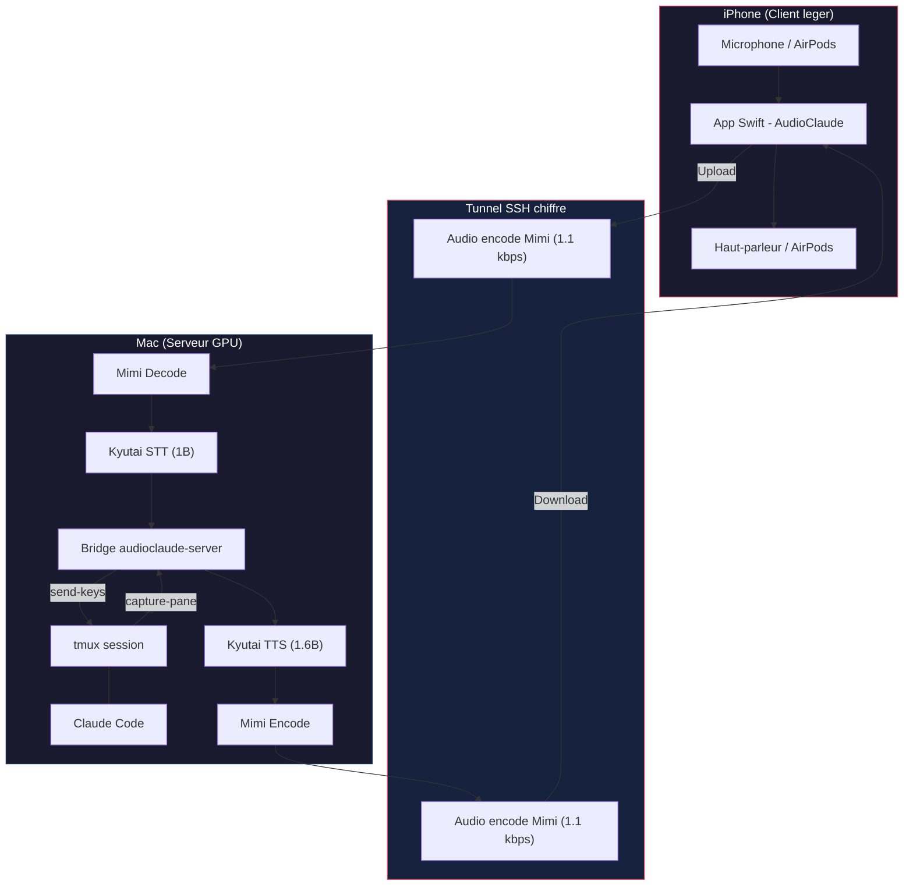
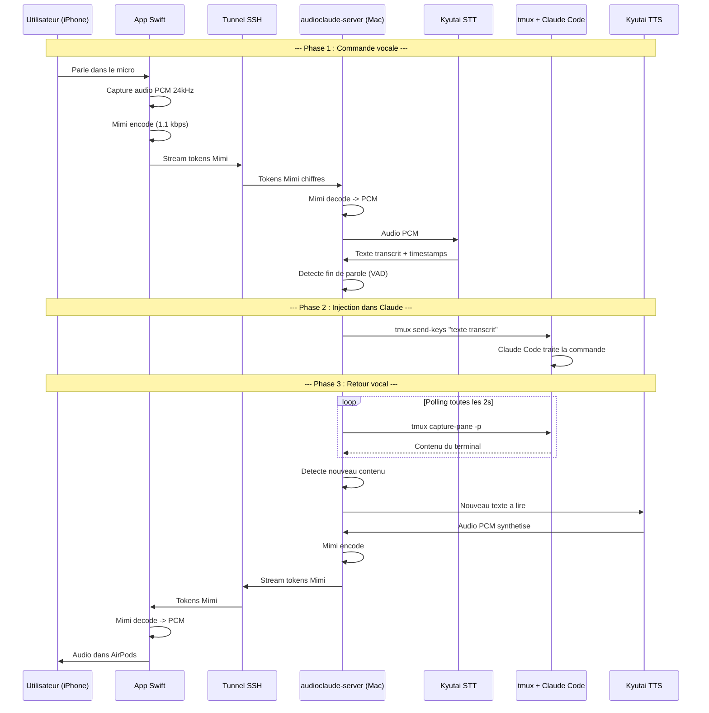
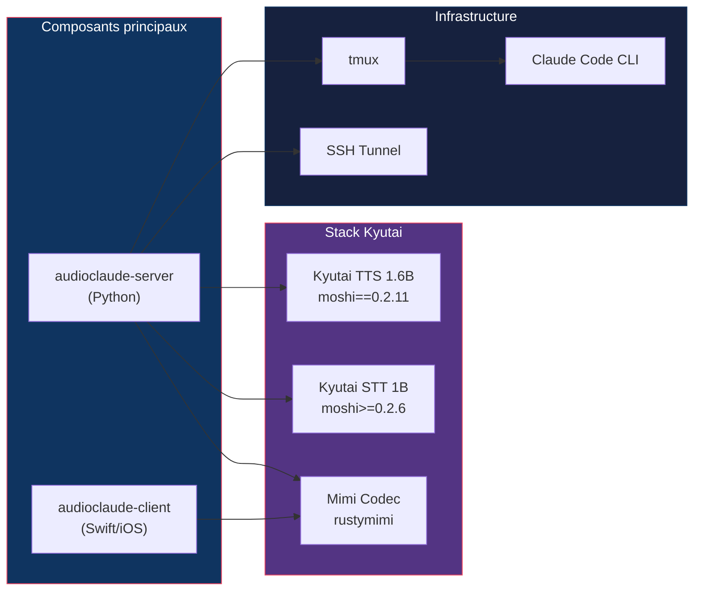
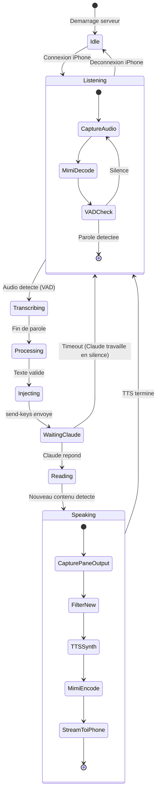
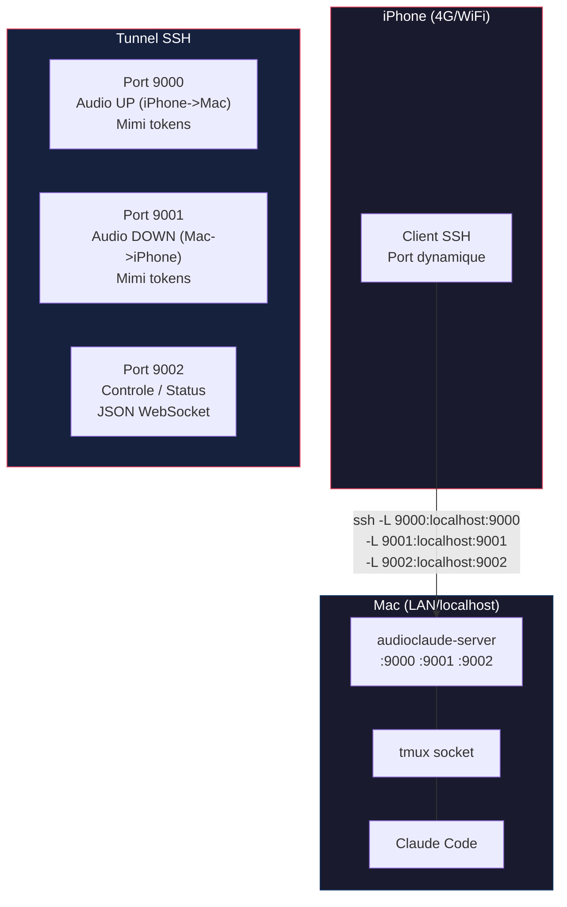
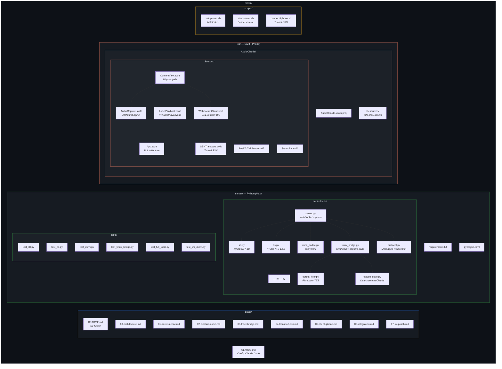

# AudioClaude — Plan de projet

> **Objectif** : Construire une interface vocale mobile (iPhone) vers un Mac distant executant Claude Code dans tmux, avec voix naturelle Kyutai (TTS/STT) et codec Mimi ultra-basse bande passante, le tout securise par SSH.

---

## Vue d'ensemble

AudioClaude transforme un iPhone en terminal vocal distant pour Claude Code. L'utilisateur peut partir faire ses courses, dicter des directives a Claude, entendre ses reponses en voix naturelle, et retrouver sa session intacte au retour.

---

## Architecture globale



---

## Flux de donnees detaille



---

## Composants du systeme



---

## Diagramme des etats du systeme



---

## Architecture reseau



---

## Stack technique

| Composant | Technologie | Version | Role |
|-----------|------------|---------|------|
| STT | Kyutai STT | 1B en_fr | Transcription voix -> texte |
| TTS | Kyutai TTS | 1.6B en_fr | Synthese texte -> voix naturelle |
| Codec | Mimi (rustymimi) | >=0.2.6 | Compression audio 1.1 kbps |
| Serveur | Python + asyncio | 3.12+ | Orchestration des composants |
| Client iOS | Swift + AVFoundation | iOS 17+ | Capture/lecture audio |
| Transport | SSH tunnel | OpenSSH | Chiffrement de bout en bout |
| Session | tmux | 3.x | Persistance terminal |
| IA | Claude Code CLI | latest | Assistant de dev |

---

## Plan de realisation par phases

| Phase | Fichier | Description | Duree estimee |
|-------|---------|-------------|---------------|
| 0 | [00-architecture.md](00-architecture.md) | Architecture et decisions techniques | - |
| 1 | [01-serveur-mac.md](01-serveur-mac.md) | Setup serveur Mac + dependances Kyutai | Phase 1 |
| 2 | [02-pipeline-audio.md](02-pipeline-audio.md) | Pipeline STT + TTS + Mimi | Phase 2 |
| 3 | [03-tmux-bridge.md](03-tmux-bridge.md) | Integration tmux <-> Claude Code | Phase 3 |
| 4 | [04-transport-ssh.md](04-transport-ssh.md) | Protocole de transport SSH + WebSocket | Phase 4 |
| 5 | [05-client-iphone.md](05-client-iphone.md) | App iOS Swift | Phase 5 |
| 6 | [06-integration.md](06-integration.md) | Tests d'integration bout-en-bout | Phase 6 |
| 7 | [07-ux-polish.md](07-ux-polish.md) | UX, robustesse, mode offline | Phase 7 |

---

## Prerequis materiel

- **Mac** : Apple Silicon (M1+) ou GPU NVIDIA (>=12 Go VRAM)
  - Pour STT 1B + TTS 1.6B en simultane : 16+ Go VRAM recommande
  - MLX sur Apple Silicon : pas besoin de GPU discrete
- **iPhone** : iPhone 12+ avec iOS 17+
- **Reseau** : WiFi local ou 4G/5G pour le mode mobile
  - Bande passante requise : ~3 kbps (2x 1.1 kbps Mimi + controle)

---

## Architecture du projet



## Arborescence cible (texte)

```
moshi/
├── CLAUDE.md                          # Config Claude Code
├── plans/                             # Documentation et plans
│   ├── README.md                      # Ce fichier
│   └── 00 a 07-*.md                   # Plans par phase
├── server/                            # Serveur Mac (Python)
│   ├── audioclaude/                   # Package principal
│   │   ├── server.py                  # WebSocket asyncio
│   │   ├── stt.py                     # Kyutai STT
│   │   ├── tts.py                     # Kyutai TTS
│   │   ├── mimi_codec.py              # Mimi encode/decode
│   │   ├── tmux_bridge.py             # Interface tmux
│   │   ├── output_filter.py           # Filtre contenu TTS
│   │   ├── claude_state.py            # Detection etat Claude
│   │   └── protocol.py                # Protocole WebSocket
│   ├── tests/                         # Tests unitaires + integration
│   ├── requirements.txt
│   └── pyproject.toml
├── ios/                               # App iPhone (Swift)
│   └── AudioClaude/
│       ├── AudioClaude.xcodeproj
│       ├── Sources/                   # Code Swift
│       └── Resources/                 # Assets, Info.plist
└── scripts/                           # Scripts utilitaires
    ├── setup-mac.sh
    ├── start-server.sh
    └── connect-iphone.sh
```
